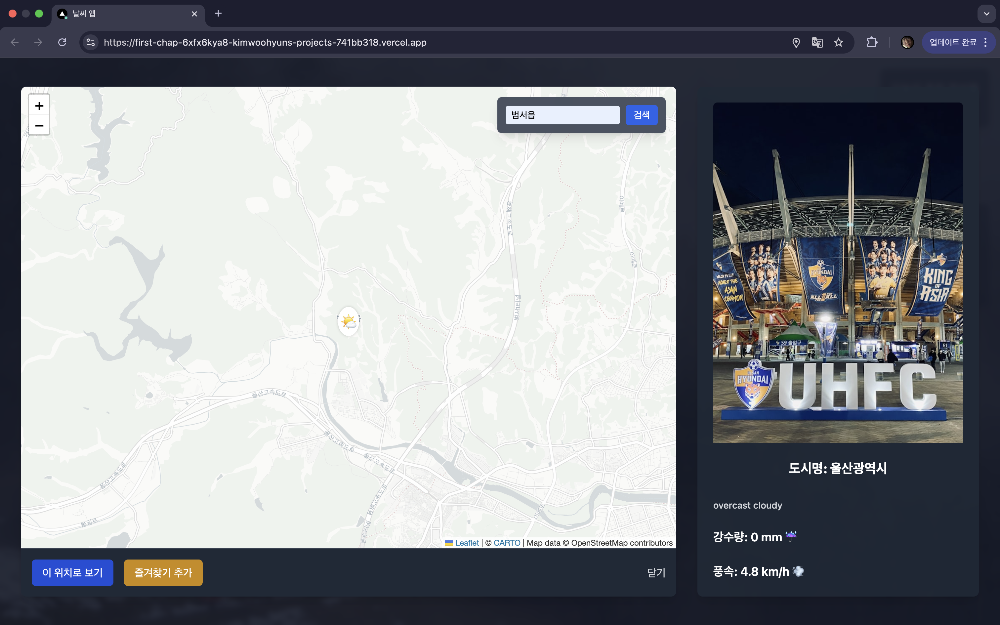

# Weather Dashboard 프로젝트

## 

---

> 🇺🇸 [View English Version](./readME.md)

## 프로젝트 소개

본 프로젝트는 위치 기반 실시간 날씨 정보 웹사이트입니다.  
사용자의 현재 위치 또는 선택한 도시의 날씨 데이터를 다양한 그래프로 시각화하고,  
도시별 즐겨찾기 기능과 미니 모달을 통한 상세 정보 제공 등을 포함합니다.

---

## 사용 기술

- **프론트엔드**
  - HTML, CSS, JavaScript (ES6+)
  - Chart.js: 실시간 날씨 데이터 시각화
  - OpenCage Geocoding API: 위치명 → 좌표 변환
  - Unsplash API: 도시별 배경 이미지 제공
- **백엔드/API**
  - Open-Meteo API: 날씨 데이터 제공
  - Vercel 배포 환경

---

## 주요 기능

### 1. 위치 기반 날씨 정보 표시

- 현재 위치 혹은 사용자가 지정한 위치의 실시간 기온, 강수량, 자외선 지수 등 제공
- 주요 날씨 데이터는 1시간 단위로 차트로 시각화

### 2. 도시별 배경 이미지 자동 변경

- 날씨 상태에 따른 키워드를 Unsplash API로 전달해 풍경 이미지 자동 업데이트

### 3. 즐겨찾기 기능

- 사용자가 원하는 도시를 즐겨찾기에 추가 가능
- 즐겨찾기 도시 클릭 시 해당 도시의 날씨 정보 및 배경으로 즉시 변경

### 4. 미니 모달 상세 정보

- 도시별 상세 정보와 이미지가 포함된 미니 모달 제공
- 모달 내 위치 변경 및 즐겨찾기 추가 기능 포함

### 5. 반응형 UI 및 사용자 경험 개선

- 카드형 UI로 날씨 정보 직관적 표시
- 차트 애니메이션 최소화로 깜빡임 방지 및 쾌적한 사용성 제공

### 6. 다크 모드

- 다크 모드를 적용해서 사용자가 보기 편하도록 UI 개선

### 7. meta data

- meta data를 추가해 직관적인 사이트 정보를 클라이언트에게 제공

### 8. local storage

- 브라우저 내에 key-value 쌍으로 최대 5MB까지 영구 저장

---

## 기능별 캡처 화면

### 1. 메인 대시보드

## 날씨 별 참고 그래프, 즐겨찾기 목록

### 2. 미니 모달 - 상세 위치 및 즐겨찾기

---

## 파일 구조

.
├── .vercel/ # Vercel 배포 설정 디렉토리
├── api/ # API 라우트 처리 폴더 (Next.js API 방식)
│ ├── geocode.js # 도시명 → 좌표 (위도/경도) 변환 API
│ ├── reverse-geocode.js # 좌표 → 도시명 역변환 API
│ └── weather.js # 날씨 데이터 요청 API
├── public/ # 공개 자산 (이미지, 파비콘 등)
│ ├── index.html # 메인 웹사이트 뷰 (SPA 진입점)
│ ├── js/ # JS 파일 모음
│ │ ├── chart.js # 차트 렌더링 및 업데이트 유틸
│ │ ├── favorites.js # 즐겨찾기 저장, 선택 처리 로직
│ │ ├── mapModal.js # 위치 검색 모달 UI 처리
│ │ ├── weatherBackground.js # Unsplash 기반 배경 이미지 처리
│ │ └── weatherClient.js # 날씨 API 호출 및 데이터 렌더링 처리
├── .env # 환경변수 (.gitignore에 포함됨)
├── .gitignore # Git 무시 설정 파일
├── readme.md # 프로젝트 설명 (영문)
├── readme.ko.md # 프로젝트 설명 (한글)
└── vercel.json # Vercel 배포 설정

---

## 기타

- 향후 로그인 연동 및 서버 기반 즐겨찾기 동기화 예정
- mobile view 구현 예정
- 즐겨찾기 crud 구현 예정
- 프레임워크로 사이트 리팩토링 예정

---

**문의**: WooHyun Kim (kwh77974481@gmail.com)
