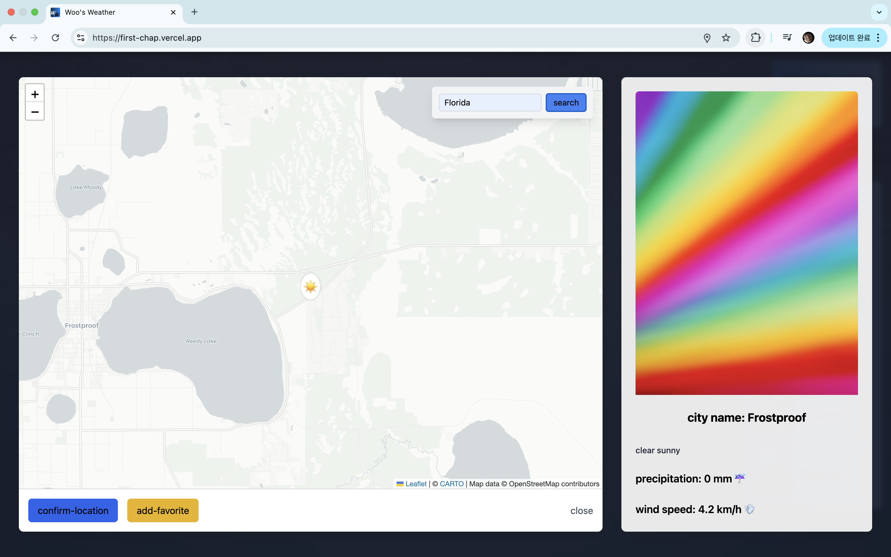

# Weather Dashboard

## 

> 🇰🇷 [한국어 버전 보기](./readME.ko.md)

## Overview

The **Weather Dashboard** is a location-based, real-time weather web application.  
It provides hourly weather data for the current or selected city, visualized through interactive charts.  
Users can favorite cities, view additional information through a mini modal, and enjoy dynamic background changes based on weather conditions.

---

## Technologies Used

- **Frontend**

  - Vanilla development - HTML5
  - Chart.js — for data visualization
  - OpenCage Geocoding API — converts city names to coordinates
  - Unsplash API — dynamic background images based on weather & cities

- **Backend / API**
  - Open-Meteo API — provides hourly weather data
  - Vercel — for deployment

---

## Key Features

### 1. Location-Based Weather Display

- Retrieves real-time temperature, precipitation, and UV index data for the current or selected location
- Displays data in intuitive hourly charts

### 2. Dynamic Background Images

- Weather codes are mapped to keywords
- Uses Unsplash API to fetch high-resolution landscape images based on the current weather or city

### 3. Favorite City Management

- Users can bookmark multiple cities
- Clicking a favorite instantly updates the UI and weather data for the selected location

### 4. Mini Modal View

- Includes detailed city info and preview image
- Offers quick buttons to update the location or add to favorites

### 5. Responsive UI & Smooth UX

- Card-based interface for clarity and visual appeal
- Minimal chart animations to reduce flicker and improve performance

### 6. Dark Mode

- Clean and modern dark theme applied to reduce visual fatigue

### 7. SEO-Friendly Metadata

- Proper Open Graph and favicon metadata are embedded

### 8. Local Storage

- Favorite cities and user interactions are persistently stored in browser localStorage

---

## Screenshots

### Main Dashboard & Weather Charts

### Mini Modal — Detailed City Info & Favorites

---

## Future Enhancements

- User login + server-side sync for favorites
- Full mobile-first responsive design
- Full CRUD support for favorite cities
- Refactor into a modern framework (e.g., React or Svelte)

---

## Deployment

**Live Demo:**  
🔗 [https://first-chap.vercel.app](https://first-chap.vercel.app)

---

## Contact

**Developer**: Ray Kim  
 Email: [kwh77974481@gmail.com](mailto:kwh77974481@gmail.com)

---
